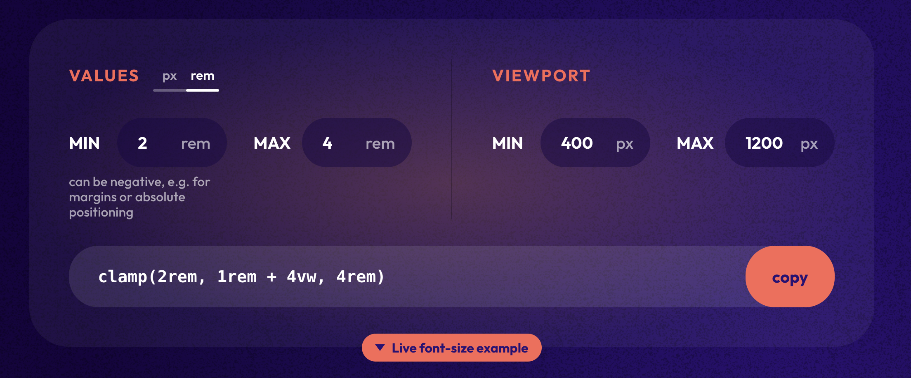

このページでは、CSSの`clamp()`関数を使った流体タイポグラフィの基本的な使い方と、デザイントークンとして管理する方法について紹介します。


## 流体タイポグラフィとは

従来のレスポンシブ設計では、画面幅ごとにメディアクエリを記述し、フォントサイズを段階的に切り替えるのが一般的でした。しかしこの方法では、「**急にサイズが変わる**」不自然さや、ブレークポイントが増えるほどコードが複雑化し、管理コストが増加する問題がありました。

**流体タイポグラフィ**は、`clamp()`関数を使って最小値〜最大値の範囲でフォントサイズを滑らかに変化させる手法です。これにより、メディアクエリの大量記述を減らしつつ、どの画面サイズでも自然な見た目を維持できます。


{/* ## メディアクエリの問題点　切り替えタイミングでカクツク */}


##  `clamp()`の基本構文

`clamp()`は次のように3つの値を指定して使用します。


```
clamp(最小値, 推奨値, 最大値)
```

「推奨値」は、通常vwなどのビューポート単位を含めて記述します。画面が狭いときは最小値、広いときは最大値で頭打ちしながら、その間の幅では推奨値の式に従って連続的に変化します。

まずはシンプルな例を見てみましょう。
最小`2rem`、最大`4rem`の範囲で、`8vw`の推奨値を基準に画面幅に応じてフォントサイズが滑らかに変化させてみます。

```html
<p class="ex--clamp">Hellow World !</p>
```

```css
.ex--clamp{
  font-size: clamp(2rem, 8vw, 4rem);
}
```

実際に確認してみるとこんな感じです。

<Preview src="clamp/ex-01" resize showSrc={false} ar='3/1' />

プレビューエリアをリサイズするか、別タブで確認してウインドウサイズを動かしてみてください。フォントサイズが変わっていくのが確認できます。


### 最小値/最大値に達する画面サイズ を意識する

さて、この時、最小値/最大値に達する画面サイズはどれくらいでしょうか。  
`clamp()` を使う時は変化させたい "画面幅の範囲" を意識して実装することも重要です。

`1rem`がデフォルト値の`16px`として、求めたいサイズを`W` として計算すると、

```
最小値                  | 最大値
-----------------------+----------------------
W * 0.08 = 2rem = 32px | W * 0.8 = 4rem = 64px
W = 32 / 0.08          | W = 64 / 0.8
W = 400px              | W = 800px
```

つまり、`400px`で最小値`2rem` ~ `800px`で最大値`4rem` の間で可変することがわかります。


### メディアクエリとの比較
同様の内容をメディアクエリで表現すると、以下のような記述が必要になります。

```css title="CSS"
.ex--clamp {
	font-size: 2rem;
}
@media (min-width: 400px) {
	.ex--clamp {
		font-size: calc(8vw);
	}
}
@media (min-width: 800px) {
	.ex--clamp {
		font-size: 4rem;
	}
}
```

`clamp()`を使えば1行で済む処理が、メディアクエリでは複数のブレークポイントを設定する必要があることがわかります。


### ツールを用いて clamp の値を計算する

どうでしょうか、`800px`で最大値に達するタイミングが少し早すぎるかもしれませんね。

<div class="a--spacer"></div>

:::help
では、`1200px`で最大値に達するように調整したくなったらどうすればいいでしょう？
:::

単純に`vw`だけを使うだけだとその条件は満たすことができません...。  
んー...計算するの大変ですね...。

そういう時はツールに頼りましょう。「[Min-Max-Value Interpolation](https://min-max-calculator.9elements.com/)」などの無料の計算ツールが数多く公開されているので、それらを活用するとよいでしょう。

https://min-max-calculator.9elements.com/

ツールに「最小値」「最大値」「変化させたい画面幅」を設定するだけで、滑らかな補間計算をした`clamp()`の式を生成してくれます。精度を求める場合や複数サイズを定義する場合に非常に便利です。

実際に使ってみます。



答えがでてきました。

`clamp(2rem, 1rem + 4vw, 4rem)` とすることで、`400px`時の`2rem`を下限、`1200px`時の`4rem`を上限として自動調整が行われます。

{/* :::note
Sassを使っている方は`@function`で計算式を用意しておいてもいいかもしれません。
::: */}


## 流体サイズをベースにしたスケーリング規則の導入

サイト全体のベースとなるフォントサイズを`clamp()`を使って流体サイズで定義し、それをもとに他のフォントサイズを相対的にスケールさせた値をデザイントークンとして定義しておくと便利です。


(以下の例では、360px ~ 1400px で 1rem ~ 2rem と、大袈裟に変化させています)

<Preview src="clamp/ex-tokens" resize ar='16/9'/>

:::note
それぞれのトークン全てにclampを使って微調整したサイズを定義してもいいですが、この例ではベースサイズを元にした[ハーモニックモジュラースケーリング](/layout/typography-scaling)を採用しています。
:::


<InnerLink path='/layout/typography-scaling/' />


### 余白の流体スケーリング

先ほど定義したベースのフォントサイズ`--fz--base`を余白のスケーリングの単位としても利用することで、流体タイポグラフィに合わせた余白を、どの画面サイズでも維持できるようになります。

```css title="例"
:root {
	/* 余白のスケーリング単位  */
	--s-unit: calc(var(--fz--base) * 0.5);

	/* スペーシング単位を1とするフィボナッチ数列でスケーリングさせる */
	--s--10: var(--s-unit);
	--s--20: calc(2 * var(--s-unit));
	--s--30: calc(3 * var(--s-unit));
	--s--40: calc(5 * var(--s-unit));
	--s--50: calc(8 * var(--s-unit));
	--s--60: calc(13 * var(--s-unit));
}
```

フィボナッチ数列でのスケーリングについても、以下のページで紹介しています。

<InnerLink path='/layout/typography-scaling' />


## html(\:root) にclamp()のフォントサイズを設定する場合の注意点


先ほどの例では、body に `--fz--base` をセットしています。

これをHTMLにセットすれば、body以下では `1rem` が `clamp` で定義された値となるため、余白のスケーリングにも単純に rem を使えば良いことになります。

```diff lang="css"
:root {
+	font-size: var(--fz--base);

	/* 余白のスケーリング単位  */
-	--s-unit: calc(var(--fz--base) * 0.5);
+	--s-unit: 0.5rem;
}

body{
-	font-size: var(--fz--base);
+	font-size: 1rem;
}
```

こっちのほうが少しシンプルになりますね。

ただし注意点がいくつかあります。


:::alert
- clampでremではなくpxを使うと、ブラウザのフォントサイズ設定の変更が反映されない。
- clampの推奨値（二番の引数）をvw単位のみで使用すると、ブラウザのフォントサイズ設定の変更が反映されない。
- body内のどこかで 再びremを使ってclamp()を再定義しようとすると、すでにremがルートで流体になっているので、おかしなことになる。
:::


なので、基本的にはベースフォントサイズはbodyに設定するのが良いのかなーと思います。


## まとめ

- **`clamp()`で滑らかなフォントサイズ変化を実現**: メディアクエリによる段階的な切り替えではなく、最小値〜最大値の範囲で連続的にサイズが変化するため、どの画面幅でも自然な見た目を保てます。
- **計算ツールを活用して効率的に設計する**: 変化させたい画面幅の範囲と最小・最大値を指定すれば、ツールが適切な`clamp()`の式を自動生成してくれます。
- **基準サイズを流体化し、余白もスケーリングさせる**: `--fz--base`などの基準サイズを`clamp()`で定義し、他のフォントサイズや余白をそこから相対的に算出することで、一貫性のあるレスポンシブデザインが構築できます。
