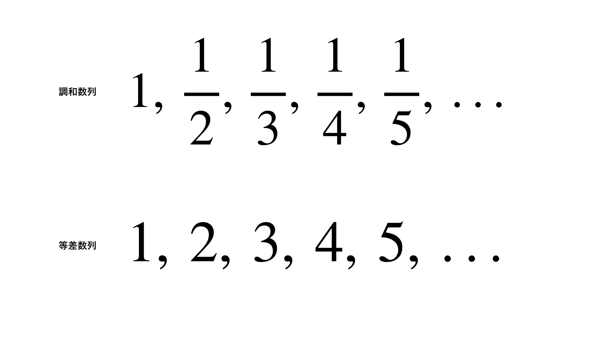
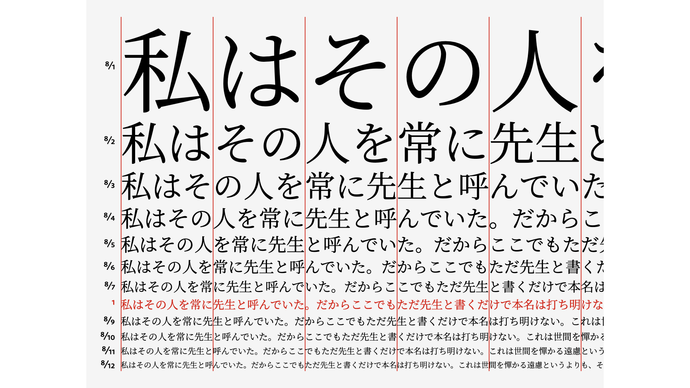

WEBサイトは、様々な文字情報から構成されます。  
キャッチコピー、本文、見出し、注釈、ボタン、その他コンポーネント等々。  
そしてこれらの情報を配置していく時に、各コンテンツ間が見やすくなるように、余白が必要です。

「**文字と余白のサイズ**」をどのように決めるかは、サイトのデザインに大きく影響するだけでなく、情報の伝達というWEBの本質にも関わってきます。

> タイポグラフィには文字によって情報を伝達するという明白な義務がある。
>
> -- エミール・ルーダー 『タイポグラフィ』
　

## モジュラースケーリング

そこで、個人のなんとなくの感覚でサイズ感を決めるのではなく、**数学的・周波数的に美しく調和した比率**（<small>例えば、黄金比の1.618、完全五度の1.5など</small>）を使ってサイズバリエーションを導き出そうというのが、「**モジュラースケーリング**」と呼ばれる手法です。


例えば、以下のボックスは、比率1.5の等比数列で段階的にサイズを変化させたものです。

<Preview css={"div{background:var(--brand);aspect-ratio:1/1;width: calc(1rem * pow(var(--_scale), var(--_i)));}"}>
<section style="display:flex;align-items:end;gap:.5em;--_scale:1.5;">
	<div style="--_i:1"></div>
	<div style="--_i:2"></div>
	<div style="--_i:3"></div>
	<div style="--_i:4"></div>
	<div style="--_i:5"></div>
	<div style="--_i:6"></div>
</section>
</Preview>

どうでしょう、調和のとれた一定のリズムで大きさが変化していく様子になんとなく気持ちよさを感じるのではないでしょうか。


かっこよくオシャレなWEBサイトを作ろうとすると、色彩感覚やフォントの選び方、構図の勉強や動きのあるアニメーションも駆使していかねばなりません。  
いわゆる**デザインセンス**というものも必要になってくるでしょう。

しかしながら、サイズ感・余白の間隔さえ美しい比率で構成することができれば、**誰にでも「シンプルで情報が読みやすいWEBサイト」を作ることができる**のではないかと個人的には考えています。


## 必読記事🗒️：音楽、数学、タイポグラフィ

さて、ざっくりとモジュラースケーリングについて把握したところで、個人的にWEBに関わる人全員が必読すべきだと思う記事を紹介します。

https://standard.shiftbrain.com/blog/music-math-typography


> タイポグラフィに限らず、デザインと音楽は深い関連がある。そしてその背後には必ず数学的なロジックが潜んでいるようなんです。  
> 文字サイズのスケールは音楽におけるスケール、つまり音階、ドレミファソラシドに当たります。  
> (\~中略\~) ウェブサイトやアプリケーションのタイポグラフィ設計は、まず文字サイズのスケールを定義するところから始める必要があります。
>
> -- [音楽、数学、タイポグラフィ](https://standard.shiftbrain.com/blog/music-math-typography)


一度でも美しいスケーリングとはどういうものかについて考えたことがある人であれば、ほぼ必ず目にするであろう記事なので、すでに知っている方も多いかとは思いますが、触れず進むことはできないため紹介させていただきます。

動画版もありますので、ぜひ一度ご視聴ください。

<YouTubeEmbed url="https://www.youtube.com/embed/LXLgMD9g3sE?si=IL3B_5S7_lNDLVkF" />


:::note
ここから先の話も、ほぼ全てこの記事の内容に基づいたものです。
:::


## モジュラースケーリングで使われる比率の種類

美しいとされる比率は色々ありますが、黄金比や白銀比、純正律（周波数の比が整数比の音律）と一致するような比率が多く使われているようです。

https://ja.wikipedia.org/wiki/%E7%B4%94%E6%AD%A3%E5%BE%8B


フォントサイズや余白のスケーリングとして採用する場合は、あまり比率が大きすぎない長2度(9/8)、短3度(6/5)、長3度(5/4)あたりが使いやすそうです。

<Preview src="moduler-scalling/geometric" ar="1/1" />

> またこれらの数字を見てみると、僕たちに馴染みの深い比率が多く含まれています。たとえば画像や映像のアスペクト比でよく使われる、短7度の16 : 9や完全5度の3 : 2、完全4度の4 : 3といった比率があります。また短6度の5 : 8は黄金比に近く、減5度（増4度）の1 : √2は白銀比です。


## ハーモニックモジュラースケーリング

さて、ここからさらに[音楽・数学・タイポグラフィ](https://standard.shiftbrain.com/blog/music-math-typography) では「調和数列」に基づいた「**ハーモニックモジュラースケーリング**」というものが紹介されています。


普通の一定比率でスケーリングすると、ベースサイズ周辺にもう少し細かくバリエーションが欲しくなるケースがけっこうあります。  
かといって、比率を下げてしまうと全体のスケーリングからダイナミックさがなくなり、大きい文字サイズに到達させようとすると段階数を増やさなければなりません。

そこで登場するのが「調和数列」です。
調和数列というのは各項の逆数が等差数列になっている数列のことです

<figure class="l--stack -ai:center" style="max-width: 600px; margin-inline:auto;">

<figcaption><small>*引用 - [音楽・数学・タイポグラフィ](https://standard.shiftbrain.com/blog/music-math-typography)*</small></figcaption>
</figure>


この分子部分の数値を大きくした調和数列を、フォントサイズのスケーリングに使用するのが「**ハーモニックモジュラースケーリング**」というものが紹介されています。

```
分子8、等差1の調和数列: 8/1, 8/2, 8/3, 8/4, 8/5, 8/6, 8/7, 8/8, ...
分子7、等差1の調和数列: 7/1, 7/2, 7/3, 7/4, 7/5, 7/6, 7/7, 7/8, ...
```

これらの 8/8 = 1, 7/7 = 1 なので、そのポイントをベースサイズとしてスケーリングを定義します。（<small>大きい方向のバリエーション数には上限があるという点には注意が必要です。</small>）


<span id='harmonic-modular-scaling-8' class='u-hidden'></span>
### フォントサイズに適用する例

分子を8とするハーモニックモジュラースケーリングをフォントサイズに適用する例を以下に示します。

```css
--fz--base: 1rem; /* 8/8 = 1 */
--fz--l: 1rem * 8/7; /* 8/7 = 1.1428571428571428 */
--fz--xl: 1rem * 8/6; /* 8/6 = 1.3333333333333333 */
--fz--2xl: 1rem * 8/5; /* 8/5 = 1.6 */
--fz--3xl: 1rem * 8/4; /* 8/4 = 2 */
--fz--4xl: 1rem * 8/3; /* 8/3 = 2.6666666666666665 */
--fz--5xl: 1rem * 8/2; /* 8/2 = 4 */
--fz--6xl: 1rem * 8/1; /* 8/1 = 8 */
```


分子を7,8,9で切り替えれるようなデモを用意しましたので確認してみてください。

<Preview src="moduler-scalling/harmonic" ar="1/1" />

個人的に、日本語サイトなら分子8がちょうど良いいくらいかなと感じています。  
ただ、英語であれば分子7くらいのダイナミックさがあったほうが良さそうかなとも思います。


> 調和数列のスケールはサイズが小さいほど密で、大きいほどまばらになっているのがわかると思います。下の等比数列のスケールにあった、基本サイズ周辺のバリエーションが足りないという問題が解消できています。
>
> -- [音楽・数学・タイポグラフィ](https://standard.shiftbrain.com/blog/music-math-typography)


<figure class="l--stack -ai:center" style="max-width: 800px; margin-inline:auto;">

<figcaption><small>*引用 - [調和数列に基づく一連の文字サイズ](https://standard.shiftbrain.com/blog/harmonious-proportions-in-type-sizes)*</small></figcaption>
</figure>

> 調和数列をもとにした文字サイズのスケールにはもうひとつ特徴があります。日本語や中国語など、全角文字を並べたときに、このように数文字ごとに幅が揃うんです。たとえば、本文8文字と、見出し3文字、キャプション10文字が同じ幅になる。もちろんここにラテン文字（いわゆる半角の英数字）が入ってきたりするとこの図のようには揃いません。しかしここで重要なのは並べたときにきっちり幅が揃うということよりも、それぞれのサイズが意味のある比率にもとづいているという点です。
>
> -- [音楽・数学・タイポグラフィ](https://standard.shiftbrain.com/blog/music-math-typography)


## 縦のリズムとフィボナッチ数列

次に、[音楽・数学・タイポグラフィ](https://standard.shiftbrain.com/blog/music-math-typography)では「縦のリズム」について触れられていきます。

> さてタイポグラフィには「縦のリズム」、ヴァーティカル・リズムという概念があります。これは横組である欧文のタイポグラフィに由来する概念で、行の折り返しによって生まれる行間や、要素間の余白に一貫性があるかどうか、という視点です。この縦のリズムに規則性がないと、読みづらかったり、情報のヒエラルキーが正しく伝わらなかったりします。これはビューが縦方向に長くなるスマホではとくに重要な視点です。
>
> -- [音楽・数学・タイポグラフィ](https://standard.shiftbrain.com/blog/music-math-typography)


行間・余白のベースサイズを**リズムの単位**と捉える考え方。


この時、普通のモジュラースケーリングにおける等比を採用すると整数倍にはならず、リズムが乱れてしまいます。

そこで登場するのが**フィボナッチ数列**です。

> 1、1、2、3、5……フィボナッチ数列は、各項の値が前の2つの項の合計になっています。そして隣り合う項の比率がどんどん黄金比（1.618）に近づいていくという特徴があります。これをスペーシングのスケールに利用します。
> 
> -- [音楽・数学・タイポグラフィ](https://standard.shiftbrain.com/blog/music-math-typography)


<Preview css={"div{background:var(--brand);aspect-ratio:1/1;width:auto; height: calc(4px * var(--_i));}"} title="フィボナッチ数列のスケーリング感">
<section style="display:flex;align-items:end;gap:4px;overflow-x:auto">
	<div style="--_i:1"></div>
	<div style="--_i:2"></div>
	<div style="--_i:3"></div>
	<div style="--_i:5"></div>
	<div style="--_i:8"></div>
	<div style="--_i:13"></div>
	<div style="--_i:21"></div>
	<div style="--_i:34"></div>
	<div style="--_i:55"></div>
</section>
</Preview>

このフィボナッチ数列を採用する案は、個人的にとてもしっくりきました。

[音楽・数学・タイポグラフィ](https://standard.shiftbrain.com/blog/music-math-typography)では行間の単位を4px、スペーシングの単位を8pxを一つの単位としてとらえることが提案されています。


## 実際の採用例

個人的に色々試してみて、現在実際に採用しているスケーリングについて紹介しておきます。（Lism CSS で採用されています）


### フォントサイズと行間

フォントサイズには、[8を分子とするハーモニックモジュラースケーリング](#harmonic-modular-scaling-8)をそのまま採用しました。

<div class="a--spacer" />
難しいのが行間です。  
[音楽・数学・タイポグラフィ](https://standard.shiftbrain.com/blog/music-math-typography)では、`line-height`の数値が4pxの倍数とする例が挙げられていました。

しかしながら、これを直接採用しようとするとフォントサイズが変更される部分で全てline-heightの値も設定する（もしくは、JavaSctiptを使う）必要がでてきます。

自分の手で作るサイト単体に対してであればそれでいいのですが、個人的にはもっと汎用的に使えるシステム化された設計が欲しかったので、少し工夫してみました。

それが次のようなものです。

```css
:root{
	/* ハーフレディング単位 を 0.125rem ≒ 2px とする */
	--hl-unit: calc(var(--REM) * 0.125);

	/* ハーフレディングのスケーリングは unit数値での等差 */
	--hl--xs: var(--hl-unit);
	--hl--s: calc(var(--hl-unit) * 2);
	--hl--base: calc(var(--hl-unit) * 3);
	--hl--l: calc(var(--hl-unit) * 4);
}

/* bodyに基準値をセット */
body{
	--hl: var(--hl--base);
}

/* 全て要素のline-heightを、ハーフレディングで管理 */
* {
	line-height: calc(1em + var(--hl) * 2);
}
```

ぱっと見、なかなか気持ち悪いことをしています。  
これは、`line-height`自体の仕様を、ハーフレディングを基準とするようにカスタマイズしたものになります。

そしてハーフレディングの単位を2pxから始めることで、上下合わせて4pxの倍数の余白がどんな文字サイズに対しても付けれるようになります。


**この方式のメリットは３点あります。**

1. 文字上下の余白量が一定になることで、縦のリズムをキープしやすい。
2. フォントサイズが大きい時に（一般的な`1.5`などの数値だと起こる）行間が大きくなりすぎてしまう問題が発生しません。
3. ハーフレディングのトリミングに計算式が必要なくなります。


<Preview src="moduler-scalling/lh-rhythm" ar="1/1" />

少し癖があるものの、気持ちいリズムが自然とできてくるので個人的にはかなり気に入っています。

<div class="a--spacer" />
:::note
実際は、さらにここに`clamp()`を使った流体タイポグラフィを導入したりしています。
:::


clampについては、また別の記事で紹介していきます。


### 余白のスケーリング

余白のスケーリングは、フィボナッチ数列を採用します。
スケーリング単位を`4px`または`8px`で組むとよいかなと感じました。

{/* 1 2 3  5  8  13 21 34  55  89 ... */}
{/* 2 4 6  10 16 26 42 68 110 178 ... */}

4, 8 を基準にしたそれぞれのフィボナッチ数列は次のような並びです。
```
--s:  5  10  20   30   40...             
4:    4   8  12   20   32   52   84    136   220
8:        8  16   24   40   64   104   168   272
```

<div class="a--spacer" />

どちらかの数列をそのまま採用してもいいのですが、個人的には少し混ぜて使うとちょうどよく感じました。


```css
:root {
	/* 余白のスケーリング単位 ( 0.5rem = 8px */
	--s-unit: calc(var(--REM) * 0.5); /* ≒ 8px */

	/* スペーシング単位 8 で フィボナッチ */
	--s--5: calc(0.5 * var(--s-unit)); /* 例外 */
	--s--10: var(--s-unit);
	--s--15: calc(1.5 * var(--s-unit)); /* 例外 */
	--s--20: calc(2 * var(--s-unit));
	--s--30: calc(3 * var(--s-unit));
	--s--40: calc(5 * var(--s-unit));
	--s--50: calc(8 * var(--s-unit));
	--s--60: calc(13 * var(--s-unit));
	--s--70: calc(21 * var(--s-unit));
	--s--80: calc(34 * var(--s-unit));
}
```

基本は 8ベースの数列を 10, 20, 30, ... に並べ、例外的に 5, 15 を追加しています。

縦のリズムを組む時は基本的に 10, 20, 30, ... の 8の倍数を使いながら、テキストとアイコンの隙間などの横方向の余白としては細かい 5 が欲しかったり、ボックスのpaddingで 15 くらいがあると便利だったりします。

5, 15, 20 は 4を単位としたフィボナッチ数列の前半の並びとも一致するので、不自然にならない良い感じのスケーリングとなります。

<Preview src="moduler-scalling/fibonacci" ar="2/1" />


## まとめ

- **フォントサイズ**には、ベースサイズ周辺のバリエーションが豊富な「ハーモニックモジュラースケーリング」（調和数列）が使いやすい
- **余白**には、整数倍で縦のリズムを保ちながら黄金比に近づく「フィボナッチ数列」が有効
- 数学的・音楽的に調和した比率を使うことで、センスに頼らず「シンプルで読みやすいデザイン」を実現できる

