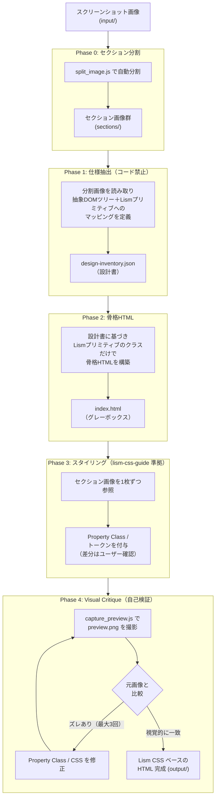

# Screenshot to Lism HTML: 仕組みと手順の解説

このドキュメントでは、デザイナーやディレクター、フロントエンドエンジニアがチームで利用することを想定し、「Screenshot to Lism HTML」機能が **どのような仕組みで、なぜこの手順を踏んで Lism CSS ベースの HTML を生成しているのか** を分かりやすく解説します。

> **位置づけ**: 本 Skill（`screenshot-to-lism-html`）は、Lism CSS 公式の `lism-css-guide` スキルの**補助スキル**です。Lism CSS の書き方・命名ルール・トークン設計は `lism-css-guide` 側に任せ、本 Skill は「**スクリーンショット画像を Lism CSS の部品（プリミティブやトークン）にどうマッピングするか**」というワークフロー制御に集中します。

---

## 1. なぜ「一発でコード生成」しないのか？

AI（LLM）に対して「この LP の画像を HTML にして」と一度に頼むと、一見それっぽいコードがすぐに出てきます。しかし、実際には以下のような問題が頻発します。

- **AI の「思い込み（ハルシネーション）」**
  AI は画像の詳細をしっかり見る前に、「LP といえばこういうレイアウトだろう」という **テンプレート**を勝手に当てはめてしまう癖があります。（例: 見出しのフォントが違う、画像の重なりが無視される、存在しないメニューが追加されるなど）
- **複雑すぎてパンクする**
  LP 全体の巨大な画像と、何百行にもなるコードを同時に処理しようとすると、AI の頭のキャパシティ（コンテキストウィンドウ）が限界に達し、細かいデザインのズレを見落としてしまいます。

この Skill では、**「AI の思い込みを防ぎ、確実にデザインを再現させる」** ために、あえて人間が設計するのと同じような **厳格なステップ（フェーズ）** を踏ませる仕組みを採用しています。

---

## 2. Lism CSS ベース HTML 生成の 5 つのステップ（Phase 0 〜 4）

この Skill を実行すると、AI は裏側で以下の手順を順番にこなしていきます。

### Phase 0: 画像のセクション分割
長すぎる LP 画像をそのまま AI に渡さず、まずは **自動スクリプトが画像を「セクションごと（見出しごとや背景色ごと）」に細かく切り分けます**。
これにより、AI が「今はこの部分だけに集中すればいい」という状態を作り、細部の見落としを防ぎます。

### Phase 1: 抽象 DOM ツリーと仕様の抽出（設計書の作成）
画像を渡してすぐにコードを書かせることは **絶対に禁止**しています。
その代わり、まず AI に **「このデザインはどういう構造か？」というテキストの設計書（抽象 DOM ツリー）** を作らせます。この設計書では、画像から読み取った要素を **Lism CSS のどのプリミティブ／コンポーネントで組むか** も同時に決めます（例: 3 列カードなら `l--columns` にマップ）。

- **例**: 「ここは 3 列のカードが並んでいる（→ `l--columns`、PC 3 列 → SP 1 列）」「ここのボタンはホバーしたら少し暗くなるはずだ（→ `-hov:*` で表現）」
- **効果**: これを事前に作らせることで、AI の「LP テンプレートの思い込み」をリセットし、目の前の画像だけに忠実な構造を定義させます。

### Phase 2: グレーボックス骨格 HTML の構築
設計書ができたら、次は **装飾を一切含まない、Lism プリミティブのクラス名（`l--stack` / `l--columns` / `l--frame` / `is--container` 等）だけを付けた HTML** を生成します。画像部分は灰色の四角（プレースホルダー）として配置します。
これは、家を建てる前の「骨組み」を作る作業です。いきなり壁紙（Property Class ／色 ／スペーシング）を貼ると構造が歪むため、まずは骨組みだけを完璧に作らせます。プリミティブ選定に迷ったら `lism-css-guide/primitive-class.md` の「カラムレイアウト Primitive の使い分けガイド」を参照します。

### Phase 3: セクションごとのスタイリング
骨組みが完成して初めて、Lism の Property Class（`-fz:*` / `-p:*` / `-bgc:*` / `-hov:*` など）による装飾（色、余白、フォント、重なり等）を当てていきます。
ここでも LP 全体を一気に塗るのではなく、**Phase 0 で分割したセクション画像を 1 つずつ見ながら**、順番にスタイリングしていくことで精度の低下を防ぎます。

**このフェーズの重要ポイント**: Phase 1 で記録した「デザイン画像から読み取った生の色・スペーシング・フォントサイズ」を、Lism CSS のデザイントークン（`--s*` / `--fz--*` / `--bdrs--*` など）と照合します。ズレがある場合は、`lism-css-guide` の「デザインデータ取り込み時のフロー」に従って **A: px で直書き / B: 最寄りトークンに丸める / C: トークンの基準値を上書き** の 3 択をユーザーに確認してから実装します。「スマホで見たら 1 列になる」といったレスポンシブは Lism の Property Class の `_{bp}` サフィックスや Props で表現します。

### Phase 4: Visual Critique（自己検証・間違い探し）
コードが完成したら、AI 自身が「自分の書いたコードが本当にデザイン通りか？」をテストします。

1. 裏側で自動的にブラウザが立ち上がり、**生成された HTML のスクリーンショット**を撮影します。
2. そのスクリーンショットと**元のデザイン画像**を並べて AI に見せ、**「間違い探し」**をさせます。
3. 「ここの余白が狭い」「ボタンの色が少し暗い」「Grid を直書きしていてレスポンシブしていない」といったズレを AI 自身が見つけ、Property Class ／ CSS を修正します。
4. これを最大 3 回繰り返し、視覚的に違いが分からなくなるまで品質を高めます。

---

## 3. この Skill を利用するメリット

- **手戻りが少ない**
  骨組みから段階的に作るため、「完成したと思ったら HTML の構造から間違っていた」という致命的な手戻りが起きにくくなります。
- **属人性の排除**
  AI が勝手なクラス名や構造を作らないよう、あらかじめ定義された「UI パターンカタログ」の中から部品を選び、それを **Lism CSS の共通プリミティブ**に落とすルールになっています。そのため、何度実行しても（誰が実行しても）一定のクオリティと統一されたコードが出力されます。
- **Lism CSS の設計思想に沿った出力**
  Lism のプリミティブ・トークン・命名規則に沿った出力になるため、生成後に手動で書き足すコードとも齟齬が生じにくく、保守性が高くなります。Lism 側の実装ルールは `lism-css-guide` にすべて委譲されているため、Lism 本体のアップデートにも追従しやすい構成です。
- **自動化された品質保証**
  最後の「間違い探し」ループにより、人間の目によるチェック前に AI が自ら微調整を行ってくれるため、チェックの負担が大幅に軽減されます。

## 4. デザイナー・ディレクターの方へ

このツールは、デザインを「ブラウザ上で確認できるプロトタイプ」に変換するプロセスを劇的に加速させます。
もし、生成された HTML のレイアウトがおかしい場合は、AI に「Phase 1 の設計書が間違っているよ」と指摘するか、Phase 0 の「画像の分割」が上手くいっているかを確認してみてください。AI の思考の途中経過（設計書）がテキストとして出力されるため、「どこで AI が勘違いしたか」がとても分かりやすくなっています。

また、Phase 3 では **デザインの数値（余白・フォントサイズなど）を Lism CSS のトークンにどう合わせるか** の相談（A/B/C の 3 択）が入ります。デザインの一貫性を優先するかトークン体系との整合性を優先するかを、その場で判断してください。
